# Upload Wizard ☁️🪄

## What is this?

Uploading and handling file uploads can be a pain. This library aims to make it easier to implement file uploads in your web application by providing simple interfaces to handle uploads from the client side to a storage provider (e.g. Cloudflare, S3) of your choice.

## Upload Sequence

```mermaid
sequenceDiagram
    participant FE as Frontend
    participant BE as Backend
    participant DB as Database
    participant SP as Storage Provider (Cloudflare)
    
    autonumber
    
    FE->>BE: Request Upload URL
    
    activate FE
    activate BE
    
    BE->>DB: Create File Entry (status = requested)
    DB-->>BE: ‎

    BE->>SP: Request Signed Upload URL
    SP-->>BE: ‎
    
    BE-->>FE: Return Signed Upload URL + confirmToken
    
    deactivate BE
    
    FE->>SP: Upload File (using signed URL)
    SP-->>FE: ‎
    
    FE->>BE: Confirm Upload (confirmToken)
    BE-->>FE: ‎
    
    activate BE
    
    BE->>DB: Get confirmToken
    DB-->>BE: ‎
    
    BE->>BE: Verify confirmToken
    
    BE->>SP: Request file
    SP-->>BE: ‎
    
    BE->>BE: Verify that file has been uploaded
    
    BE->>DB: Update File Entry (status = uploaded)
    DB-->>BE: ‎
    
    BE-->>FE: ‎
    
    deactivate BE

    loop Poll until file is ready
        
        FE->>BE: Request File
        
        activate BE
        
        BE->>DB: Get File Entry
        DB-->>BE: ‎
        
        BE->>BE: Verify that file exists
        
        BE->>SP: Request file
        SP-->>BE: ‎
        
        BE->>FE: Return file
        
        deactivate BE
    
    end
    
    deactivate FE
```

